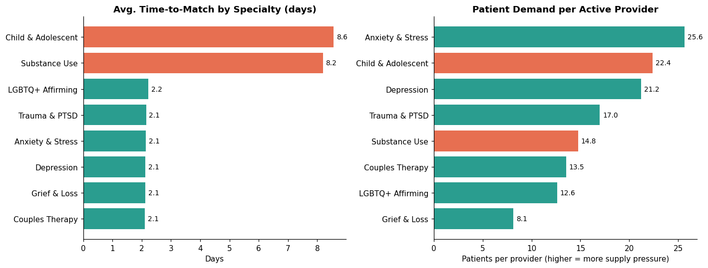
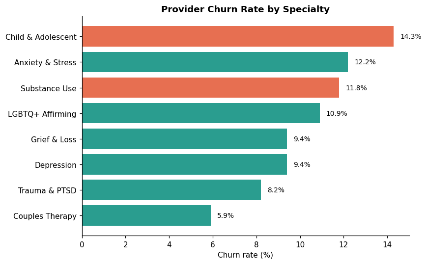
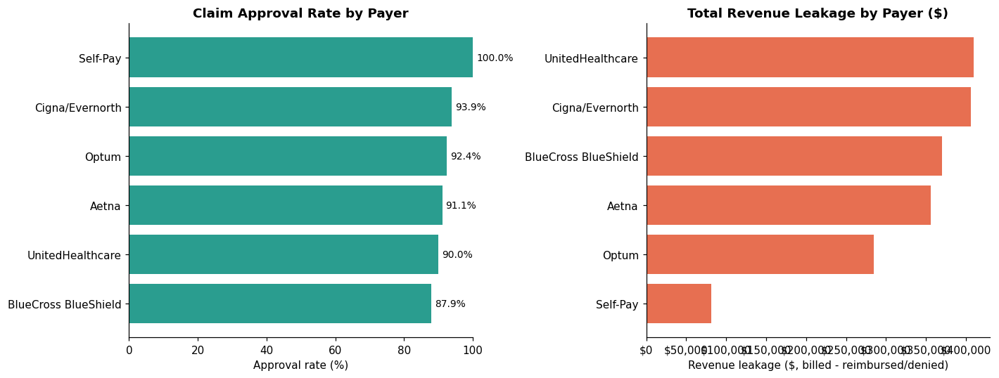
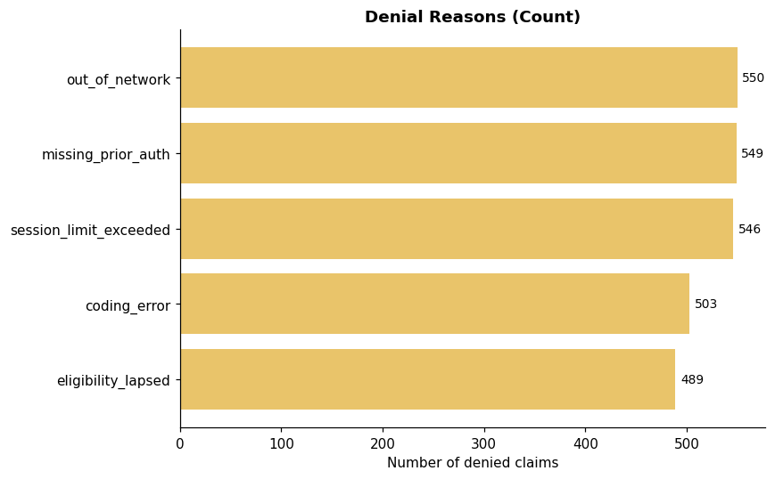

<div align="center">

# Alma Marketplace Health Analytics

**The topline funnel metric was 88% healthy. Two specialties inside it were not.**

[](dbt_project/models)
[](dbt_project)
[](data/processed)
[](#-the-honesty-clause)
[](notebooks/marketplace_health_analysis.ipynb)

*A portfolio project built before applying — a working answer to "show me you can find what
the dashboard average is hiding," using a dataset modeled on
[Alma](https://helloalma.com)'s marketplace.*

</div>

<br>

## The 10-second version

<table>
<tr>
<td width="50%" valign="top">

### 📊 What the dashboard says
```
Overall match acceptance: 88%
```
Looks fine. Ships in a slide. Nobody asks a
follow-up question.

</td>
<td width="50%" valign="top">

### 🔍 What's underneath it
```
Child & Adolescent:  8.6 days to match (4x slower)
Substance Use:       8.2 days to match (4x slower)
Decline rate:        2x the network average
Provider churn:      +5pts above baseline
```
Two specialties are structurally broken, and the
topline number is the reason nobody noticed.

</td>
</tr>
</table>

<br>

## Table of contents

- [The investigation](#the-investigation)
- [The moment I almost got it wrong](#-the-moment-i-almost-got-it-wrong)
- [The claims side: where the money leaks](#the-claims-side-where-the-money-leaks)
- [How it's built](#how-its-built)
- [Run it yourself](#run-it-yourself)
- [Data model](#data-model)
- [What this is meant to prove](#what-this-is-meant-to-prove)

<br>

## The investigation

<details open>
<summary><b>🚩 Finding 1 — Two specialties match 4x slower than everything else</b></summary>
<br>

Every specialty *except two* matches a patient in **~2.1 days** on average. Child & Adolescent
takes **8.6 days**. Substance Use takes **8.2 days**. Same patient pool, same matching engine,
same platform — just a four-fold gap that the 88% headline number completely absorbs.

<p align="center"></p>

</details>

<details>
<summary><b>🚩 Finding 2 — The decline rate confirms it isn't noise</b></summary>
<br>

One slow metric could be a fluke. A second, independent metric pointing the same direction
isn't. Patients seeking Child & Adolescent care get declined **17.1%** of the time. Substance
Use: **20.5%**. Everything else sits at **8–10%**. Two unrelated signals, same two outliers —
that's a recruiting-budget conversation, not a footnote.

</details>

<details>
<summary><b>🚩 Finding 3 — The providers who do take these cases are leaving fastest</b></summary>
<br>

Child & Adolescent providers churn at **14.3%**, against a roughly **9%** network baseline.
The two specialties with the worst matching experience are also bleeding the providers they
have. Left alone, this compounds — it doesn't stay flat.

<p align="center"></p>

</details>

<br>

## 🛑 The moment I almost got it wrong

> The obvious next chart is **"patients per provider"** — proof these specialties are simply
> understaffed. I built it expecting it to close the case.
>
> It didn't. **Anxiety & Stress has the *highest* patient-to-provider ratio in the entire
> network (25.6)** — higher than either flagged specialty — and still matches in 2 days flat.
> The clean "just hire more providers" story doesn't survive contact with this number.
>
> What actually holds up: this isn't a headcount problem, it's a **credentialing problem.**
> Fewer providers are *qualified* for these two categories specifically, and the ones who are
> decline matches at twice the normal rate. That's a narrower, less satisfying insight than
> the one I almost shipped — and it's the one that's actually true. **It's still in the
> notebook, uncut.**

<br>

## The claims side: where the money leaks

<table>
<tr><th>Payer</th><th>Approval rate</th><th>Revenue leakage</th><th>The catch</th></tr>
<tr><td>Cigna/Evernorth</td><td>93.9%</td><td>$406,120</td><td rowspan="5" valign="top">Leakage doesn't track approval rate. UnitedHealthcare has a <i>mid-pack</i> 90% approval rate but the <b>highest total leakage</b> — purely from claim volume. A "lowest approval rate" sort alone would have missed this entirely.</td></tr>
<tr><td>Optum</td><td>92.4%</td><td>$285,098</td></tr>
<tr><td>Aetna</td><td>91.1%</td><td>$356,107</td></tr>
<tr><td><b>UnitedHealthcare</b></td><td>90.0%</td><td><b>$409,834</b></td></tr>
<tr><td>BlueCross BlueShield</td><td>87.9%</td><td>$370,248</td></tr>
</table>

<p align="center"></p>

Underneath the payer numbers, denial *reasons* split into two genuinely different problems —
one fixable internally (`missing_prior_auth`, `coding_error`), one requiring a payer
conversation (`out_of_network`, `eligibility_lapsed`). Lumping these into one "denial rate"
metric would hide which lever is actually pullable.

<p align="center"></p>

<br>

## How it's built

```
synthetic source CSVs   →   dbt staging   →   dbt intermediate   →   dbt marts   →   notebook / BI
(providers, patients,        (clean,            (business              (dashboard-
 payers, matches,             rename)             logic, joins)          ready tables)
 sessions)
```

Mirrors a real analytics-engineering stack: raw tables land the way they would from source
systems (provider onboarding, patient CRM, matching engine, billing/EHR), get modeled through a
standard **staging → intermediate → marts** dbt structure, and the marts are what a BI tool or
analyst notebook queries — never the raw source.

<details>
<summary><b>📁 Full repo structure</b></summary>
<br>

```
alma-marketplace-analytics/
├── scripts/
│   ├── generate_synthetic_data.py    # builds the synthetic raw dataset
│   ├── build_duckdb_warehouse.py     # the dbt DAG, runnable locally, with data quality checks
│   └── build_notebook.py             # programmatically builds the analysis notebook
├── dbt_project/
│   ├── profiles.yml.example          # how this deploys to Snowflake/BigQuery in production
│   └── models/
│       ├── staging/                  # 1:1 with source tables, light cleaning only
│       ├── intermediate/             # business logic — time-to-match buckets, rollups
│       └── marts/
│           ├── dim_providers.sql
│           ├── fct_matches.sql               # powers the matching-funnel analysis
│           ├── fct_sessions.sql              # powers the claims & revenue analysis
│           └── dim_specialty_supply_demand.sql   # the table behind the headline finding
├── data/
│   ├── raw/                          # synthetic source CSVs
│   └── processed/marts_export/       # CSV exports of the marts, ready to load into a BI tool
├── notebooks/
│   └── marketplace_health_analysis.ipynb
└── dashboards/                       # the six charts referenced above
```

**Why DuckDB instead of a cloud warehouse:** keeps the project runnable by anyone who clones
the repo, with no Snowflake/BigQuery account required. `scripts/build_duckdb_warehouse.py` is a
direct, non-Jinja translation of the `.sql` files in `dbt_project/models/`, kept in sync with
them. `dbt_project/profiles.yml.example` shows how this would deploy against a real production
warehouse instead.

</details>

<br>

## Run it yourself

```bash
git clone <this-repo>
cd alma-marketplace-analytics
pip install -r requirements.txt

python scripts/generate_synthetic_data.py     # builds the synthetic source data
python scripts/build_duckdb_warehouse.py      # staging -> intermediate -> marts, + data quality checks
jupyter nbconvert --to notebook --execute --inplace notebooks/marketplace_health_analysis.ipynb
```

<details>
<summary>Using a real dbt-compatible warehouse instead of local DuckDB?</summary>
<br>

Copy `dbt_project/profiles.yml.example` to `~/.dbt/profiles.yml`, fill in your credentials,
point `sources.yml` at your loaded raw tables, and run `dbt run && dbt test` from
`dbt_project/` instead of the warehouse-build step above.

</details>

<br>

## Data model

<table>
<tr><th>Source table</th><th>Grain</th><th>Mimics</th></tr>
<tr><td><code>raw.providers</code></td><td>1 / therapist</td><td>Provider onboarding</td></tr>
<tr><td><code>raw.patients</code></td><td>1 / patient</td><td>Patient signup / CRM</td></tr>
<tr><td><code>raw.payers</code></td><td>1 / insurance payer</td><td>Reference data</td></tr>
<tr><td><code>raw.matches</code></td><td>1 / match attempt</td><td>Matching engine logs</td></tr>
<tr><td><code>raw.sessions</code></td><td>1 / therapy session</td><td>Billing / EHR (= billable claim)</td></tr>
</table>

<table>
<tr><th>Mart</th><th>Rows</th><th>Purpose</th></tr>
<tr><td><code>dim_providers</code></td><td>400</td><td>Provider dimension + rolled-up session/claims performance</td></tr>
<tr><td><code>fct_matches</code></td><td>6,000</td><td>Matching-funnel fact table</td></tr>
<tr><td><code>fct_sessions</code></td><td>31,284</td><td>Claims & revenue fact table</td></tr>
<tr><td><code>dim_specialty_supply_demand</code></td><td>8</td><td>The table built specifically for the headline finding</td></tr>
</table>

<br>

## What this is meant to prove

| | |
|---|---|
| **I don't stop at the topline number** | The 88% match rate is real and would pass a glance test. The two specialties hiding inside it are what actually matters. |
| **I'll walk back a finding that doesn't hold up** | The "understaffed" story looked clean until the patients-per-provider chart contradicted it. I rewrote the insight instead of keeping the version that sounded better. |
| **I build tables for the question, not from habit** | `dim_specialty_supply_demand` exists because the supply-gap question needed it — not because it was lying around in a source system. |
| **I think in pipeline layers, not one big query** | staging → intermediate → marts, same shape a production dbt project would actually use. |

<br>

## 🔓 The honesty clause

Every number above is real output from this repo's own pipeline — re-run the steps in
[Run it yourself](#run-it-yourself) and you'll get the same figures. The data itself is
**fully synthetic**, generated to statistically resemble Alma's marketplace model. No real
Alma data, patient, or provider was used anywhere in this project. This is independent
interview prep, not affiliated with or endorsed by Alma.

<div align="center">

[MIT License](LICENSE) · Built with SQL, dbt, DuckDB, and a healthy suspicion of averages

</div>
